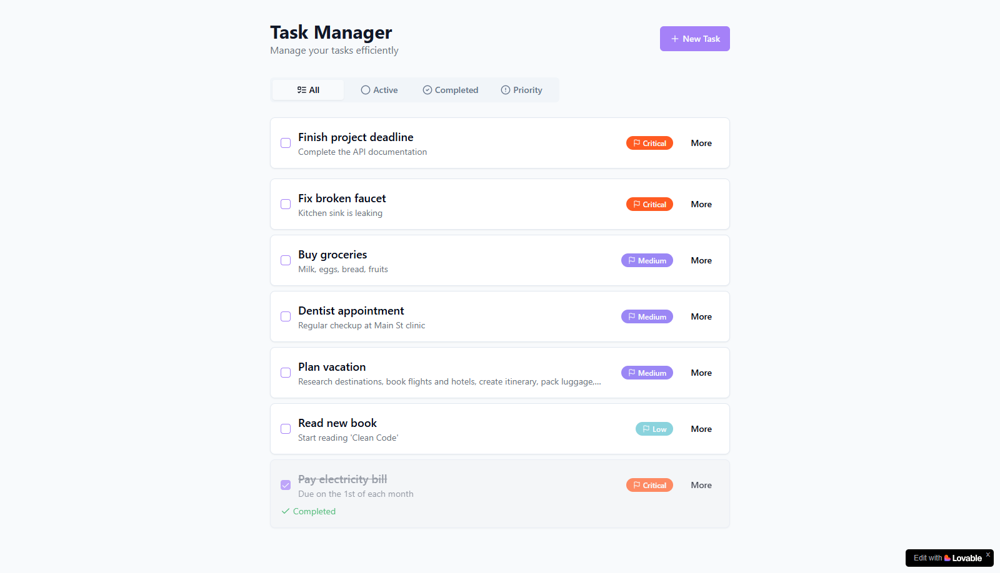
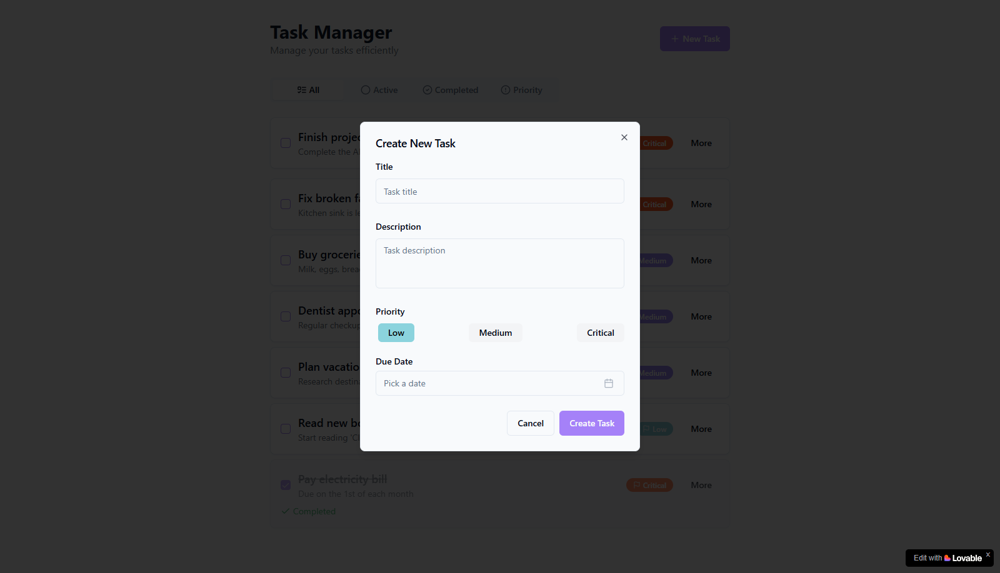
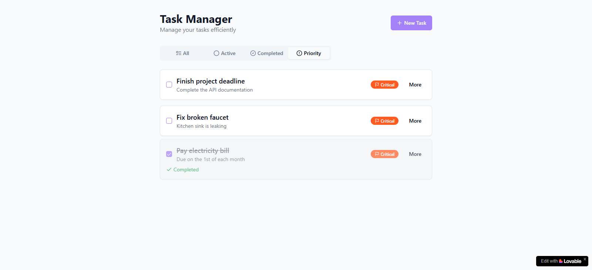

# Todo API with Go and MySQL

A RESTful API for managing todos built with Go, Gin framework, and MySQL.

## Live Frontend

You can use this API with the live frontend application.

Frontend URL: [https://concise-task-master.lovable.app/](https://concise-task-master.lovable.app/)

To connect the frontend with this API:

1. Make sure the API is running locally on `http://localhost:8080`
2. Visit the frontend URL in your browser
3. The frontend will automatically connect to your local API instance

## Frontend Interface Screenshots

### Home Page



*The main interface showing all todo items*

### Creating New Todo



*Interface for creating a new todo item*

### Completed Tasks


*View of completed todo items*

### Priority Management



*Managing priority levels of todo items*

## Features

- Create, Read, Update, and Delete todos
- Mark todos as complete
- Set priority levels (1-5)
- Store todo items in MySQL database
- RESTful API endpoints

## Prerequisites

- Go 1.24 or higher
- MySQL 8.0 or higher
- Git

## Installation

1. Clone the repository:
```bash
git clone https://github.com/Nakib00/Todo-API-in-Go-with-SQLite.git
cd todo-api
```

2. Set up the MySQL database:
```bash
mysql -u root -p
CREATE DATABASE todo-go;
```

3. Update the database configuration in `internal/config/config.go` if needed.

4. Install dependencies:
```bash
go mod tidy
```

5. Run the application:
```bash
go run cmd/main.go
```

The server will start on `http://localhost:8080`

## API Endpoints

### Todos

- `GET /api/v1/todos` - Get all todos
- `GET /api/v1/todos/:id` - Get a specific todo
- `POST /api/v1/todos` - Create a new todo
- `PUT /api/v1/todos/:id` - Update a todo
- `DELETE /api/v1/todos/:id` - Delete a todo
- `PATCH /api/v1/todos/:id/complete` - Mark a todo as complete
- `PATCH /api/v1/todos/:id/priority` - Update todo priority

### Request/Response Examples

#### Create Todo
```json
POST /api/v1/todos
{
    "title": "Complete project",
    "description": "Finish the todo API project",
    "priority": 3
}
```

#### Response
```json
{
    "id": "uuid-string",
    "title": "Complete project",
    "description": "Finish the todo API project",
    "completed": false,
    "priority": 3,
    "created_at": "2025-05-09T10:00:00Z",
    "updated_at": "2025-05-09T10:00:00Z"
}
```

## Project Structure

```
├── cmd/
│   └── main.go           # Application entry point
├── internal/
│   ├── config/          # Configuration
│   ├── handlers/        # HTTP handlers
│   ├── models/          # Data models
│   └── repository/      # Database operations
├── go.mod
├── go.sum
└── README.md
```

## Technologies Used

- [Go](https://golang.org/)
- [Gin Web Framework](https://github.com/gin-gonic/gin)
- [MySQL](https://www.mysql.com/)
- [go-sql-driver/mysql](https://github.com/go-sql-driver/mysql)

## Contributing

1. Fork the repository
2. Create your feature branch (`git checkout -b feature/amazing-feature`)
3. Commit your changes (`git commit -m 'Add some amazing feature'`)
4. Push to the branch (`git push origin feature/amazing-feature`)
5. Open a Pull Request

